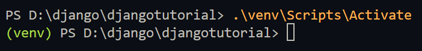

# Django Tutorial

## Description
Let’s learn by example.

Throughout this tutorial, we’ll walk you through the creation of a basic poll application.

It’ll consist of two parts:

A public site that lets people view polls and vote in them.

An admin site that lets you add, change, and delete polls.

## Prerequisites
- **Python 3.12.3** or later
- **Git** installed on your system

## Installation and Setup
Follow these steps to set up and run the Django development server on your local machine:

### 1. Clone the Repository
First, clone this repository to your local machine using Git:
```bash
git clone https://github.com/S4bril/Django-Tutorial.git
```

### 2. Navigate to the Project Directory
Once the repository is cloned, navigate to the project directory:
```bash
cd Django-Tutorial
```

### 3. Set Up a Virtual Environment
It’s important to create a virtual environment to manage your project dependencies.

Create a virtual environment:
```bash
py -m venv venv
```
### 4. Activate the virtual environment:

Windows (Command Prompt):
```bash
venv\Scripts\activate
```

Windows (PowerShell):
```bash
.\venv\Scripts\Activate
```
macOS/Linux:
```bash
source venv/bin/activate
```
After activation, you should see (venv) in the terminal, indicating that the virtual environment is active.



### 5. Install Dependencies
With the virtual environment activated, install the required packages:
```bash
pip install -r requirements.txt
```

### 6. Run the Development Server
Start the Django development server:
```bash
py manage.py runserver
```

### 7. Adding new requirements
If you added any new package don't forget to run:
```bash
pip freeze > requirements.txt
```